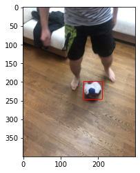
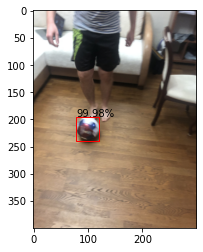

# SoccerJuggler - Transfer Learning for Soccer-Ball Detection

In this project, I trained a computer vision model to identify and detect soccer balls in order to implement a soccer ball juggle counter. I used transfer learning from MobileNetv3 in combination with a learning rate scheduler to retrain the network on a small dataset of soccer ball images.

## Problem and Motivation

A very exciting application of machine learning for me is in sports AI. These computer vision tasks are aimed at improving the consistency of rules by providing tools such as goal-line detection for referees. One of the most important tasks is ball detection, which allows for a plethora of different applications. 

I wanted to create an application that allows for counting the number of times a player can juggle a soccer ball. This would be great for soccer training and provide a fun games for young players to try to beat each other scores. In order to accomplish this, I trained a soccer-ball detector so that the vertical position of the ball could be tracked. This would allow the number of juggles to be counted by simply tracking the ball's vertical position and incrementing the count every time it oscillates.

## Dataset and Data Augmentation

Unfortuntately there aren't many good resources for soccer ball datasets. Much of the existing datasets consist of images or recordings of actual games, where the camera is far away from the ball and each image is much more complex. However, I did find one dataset from [MakeML](https://makeml.app/datasets/soccer-ball) consisting of close up images of soccer balls. This dataset has 182 images of soccer balls annotated with bounding boxes. MakeML's dataset is lacking though in that all of the images are very similar in that they are taken on a hard wood floor and are all of a white soccer ball. Therefore, I was afraid that when training the model it would overfit and not generalize well to any possible ball in various different environments (outdoors on a pitch for example). 

Each image in the dataset is 300 x 400 pixels with three channels for RGB. A sample image can be viewed below with the bounding box drawn in:

I split the original 182 images into training and testing sets based on an 80/20 split. There were 145 training images and 37 testing images. Images were also normalized so as to allow them to be used by PyTorch's pretrained models.

Much of the work of this project was done in preprocessing the data. Annotations for the bounding boxes was originially kept in XML files and had to be manually read in and converted into json (since `pd.read_xml` is not available until version 1.3.0).

## Training and ML Techniques

I used transfer learning from an existing pretrained model to speed up the time needed to train the detector. I drew inspiration from [this paper](https://arxiv.org/pdf/2009.13684.pdf) which compares different networks architectures' on detecting soccer balls. The paper found that MobileNetV3 had the best tradeoff between mAP and inference time and was able to perform real-time inference on only CPU. This makes it ideal to run on mobile phones.

The model was trained for 85 epochs with a momentum of 0.9 and a weight decay of 0.0005. Additionally, I used a learning rate scheduler to start the lr at 0.005 and half it every 15 epochs. This ensured that the model would converge slowly and wouldn't overfit to the data. I used SGD optimizer and for training and adapted the training code from [PyTorch's object detection API](https://github.com/pytorch/vision/tree/main/references/detection).

## Model Evaluation and Results

I used mean Average Precision to evaluate the model. The results from evaluating the model on different IoUs can be seen below:

| IoU      | Test mAP |
| ----------- | ----------- |
| 0.75      | 0.970       |
| 0.95      | 0.653 |
| 0.50 : 0.95   | 0.795        |

A sample prediction of the model on one of the test images can be seen below:

## Takeaways and Future Work

Throughout this project I learnt about transfer learning, gained experience working with image data and training neural networks in PyTorch, and explored applying computer vision in sports. Future work on this project could include using an expanded dataset with different soccer balls so as to generalize the model better. Additionally, a validation set could be used with a larger dataset so as to measure performance while training to avoid overfitting.